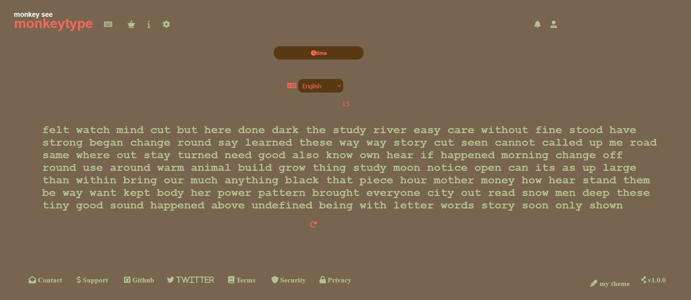

# MonkeyTypeClone

https://priyanshudjango.pythonanywhere.com/

It's kind of a clone for monkeytype website for typing speed test made with django backend and js for frontend.
The API's ,Logins,templates, django_restframework, the forms all work fine.

Tried a differnet approach from other typing test apps for the typing logic, but couldnt fix the three to four bugs in typing bugs in it, if you find this approach intereseting any inputs for improvement are appreciated.

Bug1 : when typed real fast the code doesnt work as intended.
Bug2 : when pressed space in between a word for first time it works fine but when done second time in the same typing session, things go wrong with the paragraph.

Overall, i couldnt find how to fix it, maybe the approach was not good, but I had fun time building it and learning new stuff.

